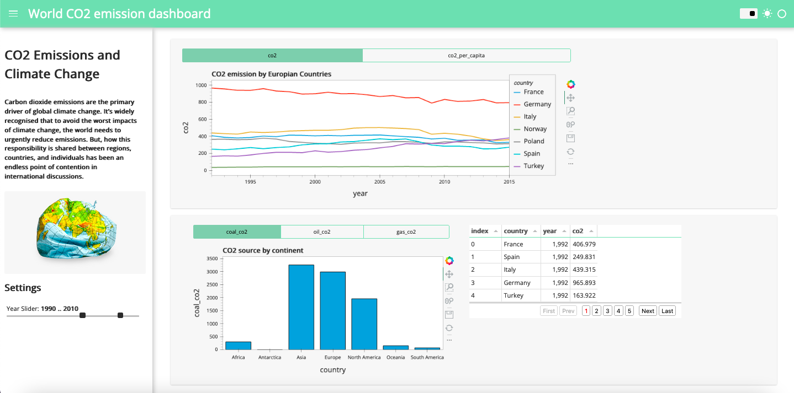

# Interactive World CO2 Dashboard

I have used the panel for the dashboard.So you can  go to Panel website and follow the intructions.

Basiclly go to your project file and run terminal;

> python 3 -m venv ./

> source bin/activate

> pip3 install hvplot jupyterlab

> deactivate

> pip3 install panel

As a data source I have used the Our World In Data source on GitHub, OWI/co2-data

@thu-vu92 helped me with the all codes, I made some changes.

In order to run the panel ;

> panel serve dashboard.ipynb

